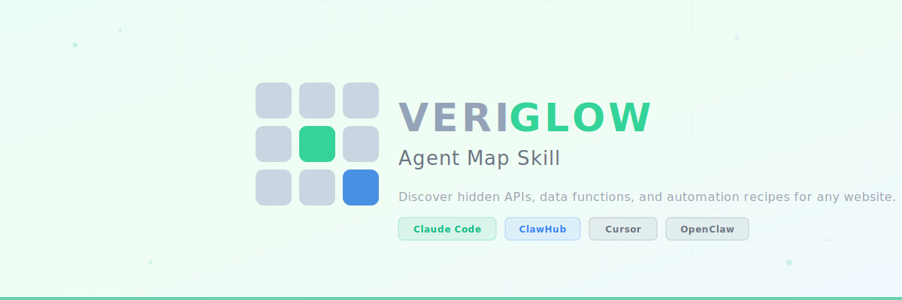
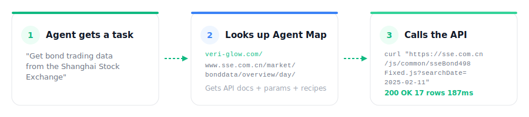

<p align="center">
  
</p>

<p align="center">
  <a href="https://veri-glow.com"></a>
  <a href="LICENSE"></a>
  <a href="https://agentskills.io"></a>
</p>

<p align="center">
  <b>Teach your AI agent to discover hidden APIs, data functions, and browser automation recipes for any website.</b>
</p>

---

## What is VeriGlow Agent Map?

**[VeriGlow Agent Map](https://veri-glow.com)** is a registry of Agent-readable documentation for websites. Each "map" documents:

| Section | What it tells your agent |
|:--------|:------------------------|
| **Available Data** | API endpoints, request parameters, response schemas, curl examples |
| **Page Internals** | JS controllers, DOM selectors, rendering method, auth status |
| **Agent Reports** | Real-world success/failure reports, response times, edge cases |

When this skill is installed, your agent automatically knows how to look up and use these maps.

---

## How It Works

<p align="center">
  
</p>

---

## Install

### Claude Code

```bash
claude plugin install github:ChizhongWang/veriglow-agent-map-skill
```

Or from the Plugin Marketplace:

```
/plugin install veriglow-agent-map
```

### OpenClaw (ClawHub)

```bash
clawhub install veriglow-agent-map
```

### Cursor / Other Agents

Copy the `skills/veriglow-agent-map/` directory into your agent's skills folder.

---

## Usage

The skill activates automatically when your agent needs website data. You can also invoke it explicitly:

```
/veriglow-agent-map
```

### Example Prompts

| Prompt | What happens |
|:-------|:-------------|
| "Get bond trading data from the Shanghai Stock Exchange" | Looks up SSE Agent Map, calls the internal API |
| "How can I scrape data from www.sse.com.cn?" | Returns API docs + browser automation recipe |
| "Find the API behind this web page: https://..." | Queries `veri-glow.com/{url}` for the map |

---

## Live Example: SSE Bond Data

The skill includes a built-in example — Shanghai Stock Exchange bond trading data.

<table>
<tr>
<td width="50%">

**Direct API Call**

```bash
curl "https://www.sse.com.cn/js/common/ \
  sseBond498Fixed.js?searchDate=2025-02-11"
```

Returns 17 bond categories with:
- Transaction count
- Face value traded
- Trading amount

</td>
<td width="50%">

**Browser Automation Fallback**

```javascript
// Set date & trigger query
document.querySelector('.js_date input')
  .value = '2025-02-11'
overviewDay.setOverviewDayParams()

// Extract table data
const rows = [...document
  .querySelectorAll('tbody tr')]
```

For when the API is blocked (e.g., overseas IP).

</td>
</tr>
</table>

> **View the full map:** [veri-glow.com/www.sse.com.cn/market/bonddata/overview/day/](https://veri-glow.com/www.sse.com.cn/market/bonddata/overview/day/)

---

## Available Maps — 59 Data Sources

| Category | Count | Example |
|:---------|------:|:--------|
| **SSE Stock Data** (股票数据) | 18 | IPO, dividends, market cap, P/E ratio, trading activity |
| **SSE Index Data** (指数) | 3 | Index quotation, composition, basic info |
| **SSE Fund Data** (基金数据) | 7 | ETF, LOF, REITs scale, daily/weekly/monthly overview |
| **SSE Bond Data** (债券数据) | 10 | Bond trading, yield, convertible bonds, active varieties |
| **SSE Other Data** (其他数据) | 17 | Margin trading, securities lending, member qualifications |
| **International APIs** | 4 | CoinPaprika (crypto), Open-Meteo (weather), Hacker News |

<p align="center">
  <a href="https://veri-glow.com"><b>Browse all 59 maps at veri-glow.com →</b></a>
</p>

---

## Skill Format

This skill follows the **[AgentSkills open standard](https://agentskills.io)** and is compatible with:

<table>
<tr>
<td align="center" width="25%"><b>Claude Code</b><br><sub>Plugin Marketplace</sub></td>
<td align="center" width="25%"><b>ClawHub</b><br><sub>OpenClaw Skills</sub></td>
<td align="center" width="25%"><b>Cursor</b><br><sub>Agent Skills</sub></td>
<td align="center" width="25%"><b>Any Agent</b><br><sub>AgentSkills spec</sub></td>
</tr>
</table>

```
veriglow-agent-map-skill/
├── .claude-plugin/
│   └── plugin.json          ← Claude Code plugin manifest
├── skills/
│   └── veriglow-agent-map/
│       └── SKILL.md         ← Core skill (cross-platform)
├── assets/
│   ├── banner.svg
│   └── how-it-works.svg
├── LICENSE
└── README.md
```

---

## License

[MIT](LICENSE) — VeriGlow

<p align="center">
  <sub>Built by <a href="https://veri-glow.com"><b>VeriGlow</b></a> — Proof over Promises</sub>
</p>
